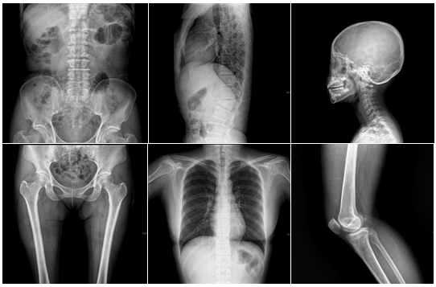

### DATA PROJECT 4
# Clasificación de imágenes de Rayos X
Grupo X: Maria, Franzi y Nacho

---------------------------

## Introducción: Objetivo del Data Project

El objetivo de este Data Project es entrenar un modelo predictivo capaz de determinar qué parte del cuerpo ha sido radiografiada. Clasificar una parte del cuerpo a partir de una imagen de rayos X puede parecer algo trivial, pero tenerlo automatizado puede ser clave para todo el sector del aprendizaje profundo en imágenes médicas. En muchos hospitales, cuando un médico solicita múltiples adquisiciones de imágenes, se crea un número de acceso para cada parte del cuerpo (p. ej., rodilla, tobillo y pierna), pero el registro de las imágenes correspondientes suele ser incorrecto dentro de cada número de acceso.

El registro incorrecto de partes del cuerpo en radiografías es un problema relevante, ya que si, por ejemplo, se desea extraer un dataset de rodilla utilizando el filtrado de PACS (base de datos donde se almacenan las imágenes medicas en un hospital) mediante la descripción del estudio, a menudo se extraerán imágenes con varias partes del cuerpo. Además, si se crea un modelo para clasificar enfermedades en alguna parte del cuerpo específica, la implementación del modelo en la práctica clínica será casi imposible. Por un lado, imagina que se crea un modelo para detectar neumonía en radiografías de tórax. Para implementar ese modelo, debemos asegurarnos de obtener solo radiografías de tórax. De lo contrario, podemos terminar tratando de diagnosticar una neumonía a partir de una radiografía de cráneo, lo que no tiene ningún sentido.

## Descripción del dataset

Todas las imágenes proporcionadas están en formato DICOM. Los datos de entrenamiento se proporcionan como un conjunto de SOPInstanceUIDs y sus etiquetas en csv. Las etiquetas se definen como una columna Target que contiene enteros que se asignan a diferentes partes del cuerpo.

El dataset de entrenamiento contiene XXXXX imágenes de rayos X etiquetadas con 21 etiquetas diferentes. Las etiquetas se representan como números enteros que corresponden cada uno a una parte del cuerpo contenida en el conjunto de datos y son las siguientes:

- Abdomen = 0
- Tobillo = 1
- Columna cervical = 2
- Tórax = 3
- Clavículas = 4
- Codo = 5
- Pies = 6
- Dedos = 7
- Antebrazo = 8
- Mano = 9
- Cadera = 10
- Rodilla = 11
- Pierna = 12
- Columna lumbar = 13
- Otros = 14
- Pelvis = 15
- Hombro = 16
- Senos paranasales = 17
- Cráneo = 18
- Muslo = 19
- Columna torácica = 20
- Muñeca = 21
